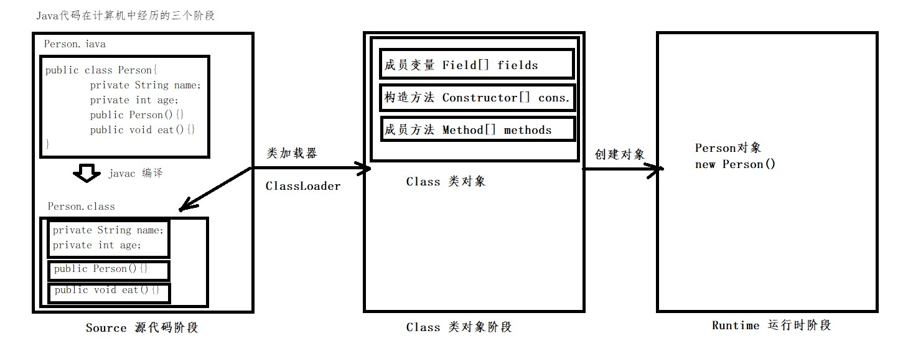
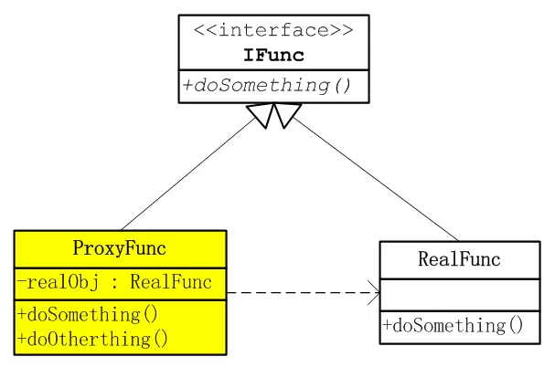

### 理解Java反射
> 程序运行过程中，对于任意一个类，都能够知道这个类的所有属性和方法；对于任意一个对象，都能够调用它的任意方法和属性；这种动态获取信息以及动态调用对象方法的功能称为java语言的反射机制

#### 1. Java反射机制相关的类

| 类名称      | 用途                                   |
| ----------- | -------------------------------------- |
| Class       | .class文件加载到JVM中方法区的Class对象 |
| Field       | class的成员变量（或类属性）            |
| Method      | class的方法                            |
| Constructor | class的构造方法                        |

##### 1.1 java程序在计算机中的三个阶段

> 
>
> - Source 源码阶段
>
> - Class 类对象阶段
>
>   > 通过类加载器，将 .class 文件加载进内存后，存在一个描述类信息的类 Class 对象，将类的各个组成部分封装成其他对象
>   >
>   > - **成员变量 ==> Field**
>   > - **构造方法 ==> Constructor**
>   > - **成员方法 ==> Method**
>
> - Runtime 运行时阶段

##### 1.2 反射的好处

> - 可以在程序运行过程中，操作这些对象
> - 可以解耦，提供程序的可扩展性

#### 2. 获取字节码Class对象的三种方式

##### 2.1 Class.forName("全类名")

> **多用于配置文件，将类名定义在配置文件中。读取文件，加载类**

##### 2.2  类名.class

> **多用于参数的传递**

##### 2.3 对象.getClass()

> **多用于对象的获取字节码的方式**

```java
// 1.Class.forName("全类名")
Class aClass1 = Class.forName("com.shadow.reflex.Person");
System.out.println(aClass1);
// 2.类.class
Class aClass2 = Person.class;
System.out.println(aClass2);
// 3.对象.getClass()
Person p = new Person();
Class aClass3 = p.getClass();
System.out.println(aClass3);
// Class对象是否一样？
System.out.println(aClass1 == aClass2); // true
System.out.println(aClass2 == aClass3); // true
```

> 结论：**同一个字节码文件（*.class）在一次程序运行过程中，只会被加载一次，不论通过哪一种方式获取的Class对象都是同一个**

#### 3. Class对象功能概述

##### 3.1 获取功能

###### 3.1.1 获取成员变量们

| 返回类型  | 方法名称                        |
| --------- | ------------------------------- |
| `Field`   | `getField(String name)`         |
| `Field[]` | `getFields()`                   |
| `Field`   | `getDeclaredField(String name)` |
| `Field[]` | `getDeclaredFields()`           |

###### 3.1.2 获取构造方法们

| 返回类型           | 方法名称                                             |
| ------------------ | ---------------------------------------------------- |
| `Constructor<T>`   | `getConstructor(Class<?>... parameterTypes)`         |
| `Constructor<?>[]` | `getConstructors()`                                  |
| `Constructor<T>`   | `getDeclaredConstructor(Class<?>... parameterTypes)` |
| `Constructor<?>[]` | `getDeclaredConstructors()`                          |

###### 3.1.3 获取成员方法们

| 返回类型   | 方法名称                                                     |
| ---------- | ------------------------------------------------------------ |
| `Method`   | `getMethod(String name,  Class<?>... parameterTypes)`        |
| `Method[]` | `getMethods()`                                               |
| `Method`   | `getDeclaredMethod(String name,  Class<?>... parameterTypes)` |
| `Method[]` | `getDeclaredMethods()`                                       |

###### 3.1.4 获取类名

| 返回类型 | 方法名称    |
| -------- | ----------- |
| `String` | `getName()` |

#### 4. Class对象 - Field

##### 4.1 getFields()、getField(String name)

> - **getFields() 获取所有 public 修饰的成员变量**
>
> - **getField(String name)获取指定名称的 public 修饰的成员变量**

###### 4.1.1 功能

- 获取值

  > get(Object obj)

- 设置值

  > set(Object obj, Object value)

##### 4.2 getDeclaredFields()、getDeclaredField(String name)

> - getDeclaredFields()获取所有的成员变量
> - getDeclaredField(String name)获取指定名称的成员变量

###### 4.2.1 给私有属性设置值

- 忽略访问权限修饰符的安全检查（暴力反射）

  > setAccessible(true)

##### 4.3 代码

```java
// 1.获取 public 修饰的成员变量
Class personClass = Person.class;
Field[] fields = personClass.getFields();
for (Field field : fields) {
    System.out.println(field);
}
Person p = new Person();
Field a = personClass.getField("a");
a.set(p,"hello");
System.out.println(a.get(p));

// 2.获取所有成员变量
Field[] declaredFields = personClass.getDeclaredFields();
for (Field declaredField : declaredFields) {
    System.out.println(declaredField);
}
Field d = personClass.getDeclaredField("d");
// 暴力反射
d.setAccessible(true);
d.set(p,"world");
System.out.println(d.get(p));
```

#### 5. Class对象 - Constructor

##### 5.1    `getConstructors()`  、`getConstructor(Class<?>... parameterTypes)` 

> -  `getConstructors()`  获取所有的 public 修饰的构造方法
> - `getConstructor(Class<?>... parameterTypes)` 获取指定的参数的 public 修饰的构造方法

###### 5.1.1 功能

- 创建对象

  > - T  newInstance(Object... initargs)  ： 有参
  > - T  newInstance()						       ： 无参
  > - 如果使用空参构造器创建对象，操作可以简化：Class对象的newInstance()方法

##### 5.2     `getDeclaredConstructors()`  、  `getDeclaredConstructor(Class<?>... parameterTypes)` 

> - `getDeclaredConstructors()`获取所有构造方法
> - `getDeclaredConstructor(Class<?>... parameterTypes)`获取指定参数的构造方法

##### 5.3 代码

```java
// 1.获取 public 修饰的构造器
Class<Person> personClass = Person.class;
Constructor<?>[] constructors = personClass.getConstructors();
for (Constructor<?> constructor : constructors) {
    System.out.println(constructor);
}
Constructor<Person> constructor = personClass.getConstructor(String.class, int.class);
System.out.println(constructor);
Person person1 = constructor.newInstance("hello", 22);

Constructor<Person> constructor1 = personClass.getConstructor();
Person person2 = constructor1.newInstance();
System.out.println(person2);
Person person = personClass.newInstance();
System.out.println(person);

// 2.获取所有构造器
Constructor<?>[] declaredConstructors = personClass.getDeclaredConstructors();
for (Constructor<?> declaredConstructor : declaredConstructors) {
    System.out.println(declaredConstructor);
}
Constructor<Person> declaredConstructor = personClass.getDeclaredConstructor(String.class, int.class);
System.out.println(declaredConstructor);
```

#### 6. Class对象 - Method

##### 6.1 `getMethods()` 、 `getMethod(String name,  Class<?>... parameterTypes)`

> -  `getMethods()` 获取全部 public 修饰的方法
> -  `getMethod(String name,  Class<?>... parameterTypes)`获取指定名称和参数的 public 修复的方法

###### 6.1.1 功能

> - 执行方法
>
>   > - Object  invoke(Object obj, Object... args)
>
> - 获取方法名
>
>   > - String getName()

##### 6.2 `getDeclaredMethods()`  、`getDeclaredMethod(String name,  Class<?>... parameterTypes)` 

> -  `getDeclaredMethods()`  获取所有成员的方法
> - `getDeclaredMethod(String name,  Class<?>... parameterTypes)` 获取指定名称和参数的方法

##### 6.3 代码

```java
// 1.获取public 修饰的方法
// 这里获取方法时，会将 父类的方法也会找出来
Class personClass = Person.class;
Method[] methods = personClass.getMethods();
for (Method method : methods) {
    System.out.println(method);
}
Person p = new Person();
// 获取指定名称的方法
Method eat = personClass.getMethod("eat");
// 执行方法
eat.invoke(p);
// 获取指定名称及参数的方法
Method method = personClass.getMethod("eat",String.class);
method.invoke(p,"fruit");

// 2.获取所有方法
Method[] declaredMethods = personClass.getDeclaredMethods();
for (Method declaredMethod : declaredMethods) {
    System.out.println(declaredMethod);
    System.out.println(declaredMethod.getName());
}
Method read = personClass.getDeclaredMethod("read");
// 暴力反射
read.setAccessible(true);
read.invoke(p);
```

> 获取类名：
>
> ```java
> // 1.获取类名称
> String name = personClass.getName();
> System.out.println(name);
> ```

#### 7. 案例剖析

> 需求：写一个"框架"，不能改变该类的任何代码的前提下，可以帮我们创建任意类的对象，并且执行其中任意方法
>
> - 实现
>
>   - 配置文件
>   - 反射
>
> - 步骤
>
>   - 将需要创建的对象的全类名和需要执行的方法对应在配置文件中
>   - 在程序中加载读取配置文件
>   - 使用反射技术来加载类文件进内存
>   - 创建对象
>   - 执行方法
>
> - 代码
>
> ```java
> // 1.加载配置文件
> Properties properties = new Properties();
> ClassLoader loader = ReflectFramwork.class.getClassLoader();
> InputStream resourceAsStream = loader.getResourceAsStream("class.properties");
> properties.load(resourceAsStream);
> 
> // 2.获取配置文件中定义的数据
> String cls = properties.getProperty("class.name");
> String mtd = properties.getProperty("method.name");
> 
> // 3.加载内进内存
> Class<?> aClass = Class.forName(cls);
> // 4.创建对象
> Object o = aClass.newInstance();
> // 5.获取对象方法
> Method method = aClass.getMethod(mtd);
> // 6.执行方法
> method.invoke(o);
> ```
>
> ```properties
> class.name=com.shadow.reflex.Person
> method.name=eat
> `
> ```


### 理解JAVA静态代理

> JAVA静态代理是指由程序员创建或工具生成的代理类，这个**类在编译期就已经是确定了的**
>
> 三大角色：
>
> - 抽象角色
>
>   定义一组规范
>
> - 真实角色
>
>   实现抽象角色所定义的行为
>
> - 代理角色
>
>   持有真实角色的引用
>
>   

**这里说明一下代理模式与装饰器模式的区别**：

> - 静态代理模式与装饰器模式的区别在于静态代理在**编译期**就已经知道具体对象了，而装饰器模式是在运行期才能确定的
>
>   ```java
>   // 静态代理的构造方法
>   private Subject subject;
>   public Proxy(){
>       //关系在编译时确定
>       subject = new RealSubject();
>   }
>   // 装饰器模式下的构造方法
>   private Component component;
>   // 装饰对象在运行过程中传入
>   public Decorator(Component component){
>       this.component = component
>   }
>   ```
>
> - 动态代理模式和装饰器模式的区别在于动态代理是让别人帮你做你不关注的事情，是对对象加以控制，不对对象功能增强；而装饰器模式是让增强对象功能（比如IO流）


### 动态代理技术

> 1. Java Proxy （接口）
> 2. CGLIB      （父类继承）
> 3. AspectJ
> 4. javaagent

> 1,2和3,4的区别：
>
> - 共同点：对JVM Class字节码进行操作
> - 不同点：操作方式不一样，1,2是新增一个完整的Class字节码，3,4修改现有类的字节码
>
> 优缺点：
>
> - 新增：必须用到反射
> - 修改：不需要用到反射


### JDK 动态代理技术

#### 1. JDK动态代理的关键类

##### 1.1 Proxy

> ```
> provides static methods for creating dynamic proxy classes and instances, 
and it is also the superclass of all dynamic proxy classes created by those methods
> ```

##### 1.2 InvocationHandler

> ```
> InvocationHandler} is the interface implemented by the <i>invocation handler</i> of a proxy instance.
> ```

#### 2. 实现步骤

##### 2.1 步骤说明

> - 创建接口
> - 创建接口实现类
> - 创建代理类

##### 2.2 案例

> https://github.com/wangchirl/reflex-proxy


### CGLIB 动态代理技术